# Assignment WT - Web for Data Science

## Project Name

SalaryScope Dashboard

## Objective

Create a functional, visually engaging, and _interactive_ data visualization web application that consumes the API you built in the previous assignment. The application must authenticate users via OAuth and be publicly accessible.

### Describe your application in a few sentences:

A web dashboard that lets user explore tech salary data interactively, search, filter, visualize on a globe, and submit your own salary records.

Insights:

- By country — how many records, salary breakdown by experience level (entry/mid/senior/executive) and work setting (remote/hybrid/in-person)
- By city — same breakdown at city level
- By job category — distribution across categories (tree map)
- By company — top companies by rating (bar chart)
- Top countries — countries with most salary records (bar chart)
- Experience & work setting distribution — pie charts across the full dataset
- Individual records — filter by year, experience, employment type, company size, company, work setting
- Full-text search — semantic search across all 137k records via Elasticsearch
- Your own data — authenticated users can submit, edit and delete their own salary records

## Deployed Application

_Provide the link to your publicly accessible application:_

> URL: cu0080.camp.lnu.se

### VG — AI/ML Feature (optional)

For a VG grade, integrate **one** AI/ML feature into the application. Pick one below or propose your own of similar scope. See the [VG issue](../../issues/12) for full details and acceptance criteria.

| Option                                                        | Status               |
| ------------------------------------------------------------- | -------------------- |
| Semantic Search — natural language queries matched by meaning | :white_large_square: |
| Content-Based Recommendations — "items similar to this one"   | :white_large_square: |
| Sentiment Analysis — analyze and visualize text sentiment     | :white_large_square: |
| Text Summarization / Generation — LLM-powered summaries       | :white_large_square: |
| Clustering & Grouping — auto-group similar items visually     | :white_large_square: |
| RAG — natural language Q&A grounded in your dataset           | :white_large_square: |
| Other: _describe_                                             | :white_large_square: |

\_Describe your chosen AI/ML feature and how it integrates with your application:

Semantic Search — Users can search across 137,000+ salary records using natural language queries. The application uses Elasticsearch with fuzzy multi-field matching across job, titles, categories, companies, countries, and cities. Results are ranked by relevance score and returned with pagination via a dedicated searchRecords GraphQL query. On the frontend, queries are debounced at 300ms to prevent excessive API calls, with results fetched using fetchPolicy: "network-only" to always return fresh matches.

AI Chat Assistant — A floating chat widget powered by the Groq LLM API allows users to ask natural language questions about salary data, job markets, and career insights. The chat is streamed in real time via a dedicated REST endpoint (/api/chat) separate from the GraphQL layer. The frontend handles streaming responses using a custom useChat hook displaying messages progressively as they arrive. This gives users a conversational interface on top of the structured dataset.

## Architecture

## Core Technologies Used

| Layer          | Technology                                   |
| -------------- | -------------------------------------------- |
| Framework      | React                                        |
| Bundler        | Vite                                         |
| Routing        | React Router                                 |
| Styling        | Tailwind CSS                                 |
| GraphQL Client | Apollo Client                                |
| API Runtime    | Node.js + Express                            |
| API Layer      | Apollo Server                                |
| ORM            | Prisma                                       |
| Database       | PostgreSQL                                   |
| Search         | Elasticsearch                                |
| AI Chat        | Groq SDK                                     |
| Authentication | OAuth 2.0 PKCE + RS256 JWT (GitHub + Google) |
| Map            | MapLibre GL + react-map-gl                   |
| Charts         | Recharts                                     |
| Deployment     | Docker + Caddy on Cumulus (LNU)              |

## How to Use

### Dashboard — Interactive Globe

- **Pan and zoom** the 3D globe to explore salary data by country and city
- **Click a country** to focus on it — the right sidebar loads salary records and breakdown stats for that country
- **Zoom in further** to switch from country view to city view — city dots appear automatically
- **Click a city** to narrow the data down to that city

### Filters — Left Sidebar _(known minor bugs — needs more research, out of time for now)_

- Use the filter panel to narrow records by **experience level**, **work setting**, **employment type**, **work year**, **company size**, and **company**
- Multiple values can be selected for the same filter (e.g. Senior + Mid)
- Filters update the record list in real time — no page reload needed
- Click **Clear** to reset all filters

### Salary Records — Right Sidebar _(known minor bugs — needs more research, out of time for now)_

- The record list shows paginated salary entries for the selected country or city
- Click **Load more** to fetch the next page
- Each row shows job title, company, salary, experience level, work setting, and year

### Analytics Page

- Overview stats: total records, countries, companies, and job categories in the dataset
- Bar charts: top 20 countries by record count, top 20 companies by rating
- Tree map: job category distribution
- Pie charts: experience level breakdown and work setting distribution

### Search

- Use the search bar to find records by job title, company, country, or city
- Results are matched semantically via Elasticsearch — partial and fuzzy matches are supported
- Click a result to navigate to its location on the globe

### AI Chat Assistant _(works well for most questions — does not have an answer for everything)_

- Click the floating chat bubble in the bottom right corner
- Ask questions in natural language about salaries, job markets, or career insights
- Responses are streamed in real time from the Groq LLM

### Creating Your Own Records

- Log in via GitHub, Google OAuth or Create Own Account
- Click **Add** mode on the globe, then click a location to open the record form
- Fill in salary details and submit — your record appears in the list immediately
  - **PS:** Records submitted for small or less-known cities may not appear as dots on the globe. The map does not store coordinates in the database, city dot positions are read directly from MapLibre's rendered map tiles at runtime. A city only gets a dot if MapLibre renders a geographic feature with that city's name in its tile data at the current zoom level. Small cities are either absent from the tile data entirely, or only appear at zoom levels the dashboard does not reach. This is a known limitation of the current architecture, fixing it would require storing latitude/longitude in the database when a record is created.

- Visit your **Profile** page to view, edit, or delete your submitted records

## Acknowledgements

### Datasets

- [Jobs in Data 2024](https://www.kaggle.com/datasets/hummaamqaasim/jobs-in-data) — Kaggle
- [Salary Dataset with Extra Features](https://www.kaggle.com/datasets/inductiveanks/employee-salaries-for-different-job-roles) — Kaggle
- [Software Professional Salaries](https://www.kaggle.com/datasets/iamsouravbanerjee/software-professional-salaries-2022) — Kaggle
- [H-1B Tech Salaries 2024](https://www.dol.gov/agencies/eta/foreign-labor/performance) — US Department of Labor
- [European IT Salary Survey 2020](https://www.kaggle.com/) — Kaggle

### Documentation & References

- [MapLibre GL JS](https://maplibre.org/maplibre-gl-js/docs/) — map rendering and tile layers
- [react-map-gl](https://visgl.github.io/react-map-gl/) — React wrapper for MapLibre
- [Apollo Client](https://www.apollographql.com/docs/react/) — GraphQL client
- [Apollo Server](https://www.apollographql.com/docs/apollo-server/) — GraphQL server
- [Prisma](https://www.prisma.io/docs/) — ORM and database access
- [Elasticsearch](https://www.elastic.co/docs/) — full-text search
- [Groq API](https://console.groq.com/docs/) — LLM streaming chat
- [Tailwind CSS](https://tailwindcss.com/docs/) — utility-first styling
- [React Router](https://reactrouter.com/) — client-side routing
- [Recharts](https://recharts.org/) — chart components
- [BigDataCloud Reverse Geocoding API](https://www.bigdatacloud.com/geocoding-apis/reverse-geocode-to-city-api) — location lookup on map click
- [CARTO](https://carto.com/) — map tile style (Dark Matter)
- [OAuth 2.0 PKCE — RFC 7636](https://datatracker.ietf.org/doc/html/rfc7636) — auth flow specification
- [Material Symbols](https://fonts.google.com/icons) — icon font

### YouTube References

- [React Tutorial for Beginners](https://www.youtube.com/watch?v=SqcY0GlETPk&t=163s)
- [React JS 19 Full Course 2025 — Build an App and Master React in 2 Hours](https://www.youtube.com/watch?v=dCLhUialKPQ)
- [Build & Deploy Full Stack Employee Management System in React JS — MERN Stack Project 2026](https://www.youtube.com/watch?v=dlu8PmKXopU)
- [50+ Hours React.js 19 Monster Class](https://www.youtube.com/watch?v=M9O5AjEFzKw)
- [OAuth 2.0 Course for Beginners](https://www.youtube.com/watch?v=WSsOXo07LeE)
- [OAuth PKCE — Proof Key for Code Exchange Explained](https://www.youtube.com/watch?v=h_1JAh3JPkI)
- [OAuth 2.0 Deep Dive — OpenID Connect, PKCE, Device Flow, Client Credential Grant](https://www.youtube.com/watch?v=MzKN7Vi4DZM)
- [GraphQL Playlist](https://www.youtube.com/playlist?list=PLGHe6Moaz52My7w7pr3jpDL_2FqzljfWd)

### AI, CLI Contributions:

- [Claude Code](https://claude.ai/code) (Anthropic)
  - Used as an AI coding assistant throughout development for architecture decisions, code review, debugging, and diagram verification
  - Researching best practices and documentation structure
- [Google Stitch](https://stitch.withgoogle.com)
  - Used to convert Figma designs into animated static pages and refine the visual design with Gemini
- [Gemini Pro](https://gemini.google.com)
  - Used for web research on best practices and architecture decisions
- [ChatGPT](https://chat.openai.com)
  - Used for documentation language and writing assistance
- [Figma](https://figma.com)
  - Manual UI/UX design and layout planning
- [Claude Design](https://www.anthropic.com/news/claude-design-anthropic-labs)
  - Design examples for small visual details such as map dots and visual improvements
