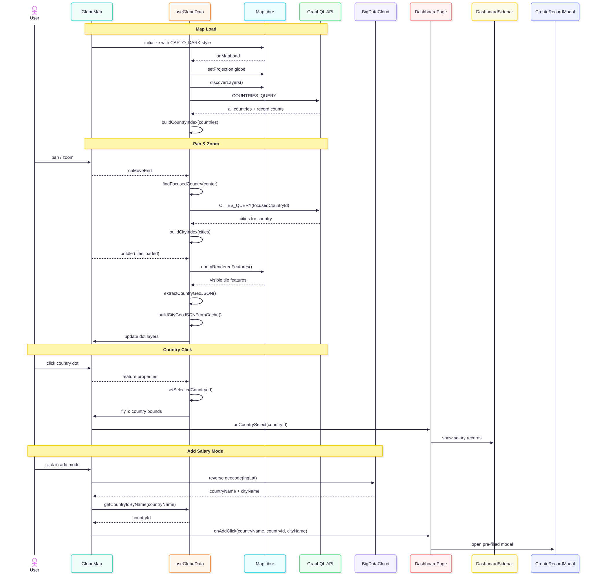

# dashboard/

The core of the app. An interactive 3D globe where you explore salary data by clicking countries and cities.





---

## DashboardPage.jsx

Top-level layout. Holds three pieces of shared state:

- **Selected location** — which country or city the user clicked on the globe (local React state)
- **Active filters** — what filters are currently applied (`useDashboardFilters`, stored in the URL)
- **Add mode** — boolean that enables the "click to add salary" flow (only shown when logged in)

It composes three things side by side and passes state between them:

```
┌─────────────────────┬─────────────────────────────────┐
│  DashboardFilter-   │         GlobeMap       ┌────────│
│  Sidebar            │                        |        │
│  (filter controls)  │  (interactive 3D globe)|        │
│                     │                        |        |
│  useFilterOptions   │                        │  Dash- │
│  (options for the   │                        │  board │
│  selected region)   │                        │  Side- │
│                     │                        │  bar   │
└─────────────────────┴────────────────────────┴────────┘
```

When the user clicks a different country on the globe while a company filter is active, the company filter is cleared automatically — because that company might not exist in the new country.

**Add mode flow:**  
Logged-in users see an "Add Salary" button. Clicking it enters add mode — a banner appears at the top and the cursor changes to a crosshair. The user then clicks anywhere on the globe. `GlobeMap` calls BigDataCloud's reverse geocode API to resolve the clicked coordinates to a country and city name, then calls `onAddClick(countryName, countryId, cityName)` back to `DashboardPage`. This opens `CreateRecordModal` pre-filled with the detected location. After a successful submission `refetchCities()` is called to make any newly created city dot appear on the map.

---

## DashboardFilterSidebar.jsx

The left panel. Renders six collapsible filter sections populated from the API:

```
Experience Level   →  EN / MI / SE / EX  (short codes + full strings both handled)
Work Setting       →  Remote / Hybrid / In-person
Employment Type    →  FT / PT / CT / FL
Company Size       →  S / M / L
Year               →  2020 – 2024
Company            →  searchable list, scoped to the selected country
```

Filter options are loaded by `useFilterOptions(countryId, cityId)` — they only show values that actually exist in the data for the selected region. If no region is selected the filter list is empty.

Each click calls `toggle(key, value)` from `useDashboardFilters`, which writes the new state to the URL. The URL is the source of truth — refreshing the page preserves all filters.

---

## DashboardSidebar.jsx

The right panel. Slides in from the right when a country or city is clicked on the globe.

Two sections:

**1. Breakdown stats** (top)  
Fires `COUNTRY_SIDEBAR_QUERY` or `CITY_SIDEBAR_QUERY` for the selected location. Shows total record count plus splits by experience level and work setting. These counts respect the selected region but not the active filters — they give a full picture of what data exists.

**2. Salary records** (bottom)  
Renders `SalaryList` with the selected country/city ID and all active filters. This is the paginated list of actual records, filtered to match what the user selected.

The sidebar is resizable — drag its left edge to make it wider or narrower.

---

## CreateRecordModal.jsx

Opens after the user clicks a location on the globe in add mode. Pre-filled with the country name (read-only) and the city name detected by BigDataCloud.

Fields:

- **City** — text, pre-filled from geocoding, editable
- **Job Title** — free text, triggers `findOrCreate` on the API
- **Salary** — numeric
- **Currency** — text
- **Experience Level** — EN / MI / SE / EX
- **Employment Type** — FT / PT / CT / FL
- **Work Setting** — Remote / Hybrid / In-Person
- **Company Size** — S / M / L
- **Work Year** — numeric

Calls `CREATE_SALARY_RECORD` with `source: "user_submitted"`, passing `jobTitle` and `cityName` instead of IDs — the API handles `findOrCreate` for both. On success calls `onCreated()` which closes the modal and triggers `refetchCities()`.

---

## EditRecordModal.jsx

Opens from the Profile page when the user clicks "Edit" on one of their salary records.

Country, city, and job title are read-only — they cannot be changed after submission. All other fields (salary, currency, experience level, employment type, work setting, company size, work year) are editable.

Calls `UPDATE_SALARY_RECORD` with only the changed fields. On success calls `onUpdated()` to refresh the record list.

---

## Filter data flow

```
useDashboardFilters()
  reads/writes URL search params  (?exp=EN&setting=In-person)
         │
         ├──► DashboardFilterSidebar
         │      useFilterOptions(selectedCountryId)
         │        └── filterOptions query → distinct values for that region
         │              → renders checkboxes with active state from URL
         │
         └──► DashboardSidebar → SalaryList
                SALARY_LIST_QUERY(countryId, offset, ...filters)
                  └── single value per dimension → sent to API as filter
                      two or more values → sent as null, applied client-side
```

Storing filters in the URL means they survive page reload, can be bookmarked, and can be shared as a link.
